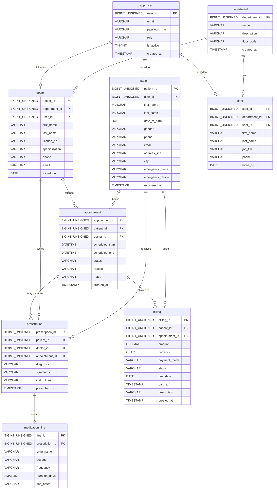

```mermaid
erDiagram
department {
BIGINT_UNSIGNED department_id PK
VARCHAR name
VARCHAR description
VARCHAR floor_code
TIMESTAMP created_at
}
app_user {
BIGINT_UNSIGNED user_id PK
VARCHAR email
VARCHAR password_hash
VARCHAR role
TINYINT is_active
TIMESTAMP created_at
}
patient {
BIGINT_UNSIGNED patient_id PK
BIGINT_UNSIGNED user_id FK
VARCHAR first_name
VARCHAR last_name
DATE date_of_birth
VARCHAR gender
VARCHAR phone
VARCHAR email
VARCHAR address_line
VARCHAR city
VARCHAR emergency_name
VARCHAR emergency_phone
TIMESTAMP registered_at
}
doctor {
BIGINT_UNSIGNED doctor_id PK
BIGINT_UNSIGNED department_id FK
BIGINT_UNSIGNED user_id FK
VARCHAR first_name
VARCHAR last_name
VARCHAR license_no
VARCHAR specialization
VARCHAR phone
VARCHAR email
DATE joined_on
}
staff {
BIGINT_UNSIGNED staff_id PK
BIGINT_UNSIGNED department_id FK
BIGINT_UNSIGNED user_id FK
VARCHAR first_name
VARCHAR last_name
VARCHAR job_title
VARCHAR phone
DATE hired_on
}
appointment {
BIGINT_UNSIGNED appointment_id PK
BIGINT_UNSIGNED patient_id FK
BIGINT_UNSIGNED doctor_id FK
DATETIME scheduled_start
DATETIME scheduled_end
VARCHAR status
VARCHAR reason
VARCHAR notes
TIMESTAMP created_at
}
prescription {
BIGINT_UNSIGNED prescription_id PK
BIGINT_UNSIGNED patient_id FK
BIGINT_UNSIGNED doctor_id FK
BIGINT_UNSIGNED appointment_id FK
VARCHAR diagnosis
VARCHAR symptoms
VARCHAR instructions
TIMESTAMP prescribed_on
}
medication_line {
BIGINT_UNSIGNED line_id PK
BIGINT_UNSIGNED prescription_id FK
VARCHAR drug_name
VARCHAR dosage
VARCHAR frequency
SMALLINT duration_days
VARCHAR line_notes
}
billing {
BIGINT_UNSIGNED billing_id PK
BIGINT_UNSIGNED patient_id FK
BIGINT_UNSIGNED appointment_id FK
DECIMAL amount
CHAR currency
VARCHAR payment_mode
VARCHAR status
DATE due_date
TIMESTAMP paid_at
VARCHAR description
TIMESTAMP created_at
}
department ||--o{ doctor : "has"
department ||--o{ staff : "has"
app_user ||--o| patient : "linked to"
app_user ||--o| doctor : "linked to"
app_user ||--o| staff : "linked to"
patient ||--o{ appointment : "books"
doctor ||--o{ appointment : "attends"
patient ||--o{ prescription : "receives"
doctor ||--o{ prescription : "writes"
appointment ||--o{ prescription : "may generate"
prescription ||--|{ medication_line : "contains"
patient ||--o{ billing : "billed"
appointment ||--o{ billing : "linked to"
```
